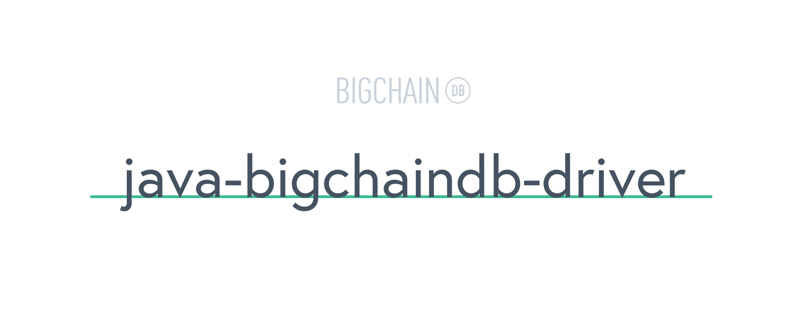

 [](https://www.bigchaindb.com)

> Official Java driver for [BigchainDB](https://github.com/bigchaindb/bigchaindb) created by [Authenteq](https://authenteq.com).

**Please note**: due to non-official org.json implementation the driver is not compatible with Android

## Compatibility

| BigchainDB Server | BigchainDB Java Driver |
| ----------------- |------------------------------|
| `1.0`             | `0.1.x`                      |


## Contents

* [Installation and Usage](#installation-and-usage)
* [Example: Create a transaction](#example-create-a-transaction)
* [Documentation](#bigchaindb-documentation)
* [Authors](#authors)
* [License](#license)

## Installation and Usage
The build system now is fully gradle-based, so to build the driver run:
```bash
./gradlew install
```
or use maven
```bash
mvn clean install
```

## Set up your configuration
```java
BigchainDbConfigBuilder
	.baseUrl("https://test.ipdb.io")
	.addToken("app_id", "2bbaf3ff")
	.addToken("app_key", "c929b708177dcc8b9d58180082029b8d").setup();
```

## Example: Create a Transaction
```java
//    prepare your keys
net.i2p.crypto.eddsa.KeyPairGenerator edDsaKpg = new net.i2p.crypto.eddsa.KeyPairGenerator();
KeyPair keyPair = edDsaKpg.generateKeyPair();

//    Set up your transaction
Transaction transaction = BigchainDbTransactionBuilder.init()
	.addAsset("firstname", "John")
	.addAsset("lastname", "Smith")
	.addMetaData("what", "My first BigchainDB transaction")
	.addMetaData("this", "My 1st metadata BigchainDB transaction")
	.buildOnly((EdDSAPublicKey) keyPair.getPublic(), (EdDSAPrivateKey) keyPair.getPrivate());

```

## Example: Create and Sign Transaction
```java
//    prepare your keys
net.i2p.crypto.eddsa.KeyPairGenerator edDsaKpg = new net.i2p.crypto.eddsa.KeyPairGenerator();
KeyPair keyPair = edDsaKpg.generateKeyPair();

//    Set up your transaction
Transaction transaction = BigchainDbTransactionBuilder.init()
	.addAsset("firstname", "John")
	.addAsset("lastname", "Smith")
	.addMetaData("what", "My second BigchainDB transaction")
	.addMetaData("this", "My 2nd metadata BigchainDB transaction")
	.buildAndSignOnly((EdDSAPublicKey) keyPair.getPublic(), (EdDSAPrivateKey) keyPair.getPrivate());

```

## Example: Create, Sign and Send a Transaction
```java
//    prepare your keys
net.i2p.crypto.eddsa.KeyPairGenerator edDsaKpg = new net.i2p.crypto.eddsa.KeyPairGenerator();
KeyPair keyPair = edDsaKpg.generateKeyPair();

//    Set up your transaction
Transaction transaction = BigchainDbTransactionBuilder.init()
	.addAsset("firstname", "John")
	.addAsset("lastname", "Smith")
	.addMetaData("what", "My third BigchainDB transaction")
	.addMetaData("this", "My 3rd metadata BigchainDB transaction")
	.buildAndSign((EdDSAPublicKey) keyPair.getPublic(), (EdDSAPrivateKey) keyPair.getPrivate())
	.sendTransaction();

```

<h2>Api Wrappers</h2>
<h3>Transactions</h3>

<h4>Send a Transaction</h4>

```java
TransactionApi.sendTransaction(Transaction transaction) throws IOException
```

<h4>Send a Transaction with Callback</h4>

```java
TransactionApi.sendTransaction(Transaction transaction, final GenericCallback callback) 
```

<h4>Get Transaction given a Transaction Id</h4>

```java
Transaction TransactionApi.getTransactionById(String id) throws IOException
```

<h4>Get Transaction given an Asset Id</h4>

```java
Transactions TransactionApi.getTransactionsByAssetId(String assetId, Operations operation)
```

<h3>Outputs</h3>

<h4>Get Outputs given a public key</h4>

```java
Outputs getOutputs(String publicKey) throws IOException
```

<h4>Get Spent Outputs given a public key</h4>

```java
Outputs getSpentOutputs(String publicKey) throws IOException
```

<h3>Assets</h3>

<h4>Get Assets given search key</h4>

```java
Assets getAssets(String searchKey) throws IOException
```

<h4>Get Assets given search key and limit</h4>

```java
Assets getAssetsWithLimit(String searchKey, String limit) throws IOException
```

<h3>Blocks</h3>

<h4>Get Blocks given block id</h4>

```java
Block getBlock(String blockId) throws IOException
```

<h4>Get Blocks given transaction id and status</h4>

```java
List<String> getBlocks(String transactionId, String status) throws IOException
```

<h3>Votes</h3>

<h4>Get Votes given a block id</h4>

```java
Votes getVotes(String blockId) throws IOException 
```

<h3>Statuses</h3>

<h4>Get Transaction status</h4>

```java
Status getTransactionStatus(String transactionId) throws IOException
```

<h4>Get Block status</h4>

```java
Status getBlockStatus(String blockId) throws IOException
```


## BigchainDB Documentation

- [HTTP API Reference](https://docs.bigchaindb.com/projects/server/en/latest/http-client-server-api.html)
- [The Transaction Model](https://docs.bigchaindb.com/projects/server/en/latest/data-models/transaction-model.html?highlight=crypto%20conditions)
- [Inputs and Outputs](https://docs.bigchaindb.com/projects/server/en/latest/data-models/inputs-outputs.html)
- [Asset Transfer](https://docs.bigchaindb.com/projects/py-driver/en/latest/usage.html#asset-transfer)
- [All BigchainDB Documentation](https://docs.bigchaindb.com/)

## Authors

- The [Authenteq](https://authenteq.com) team and others (see CONTRIBUTORS file).

## License

```
    java-bigchaindb-driver - Official Java driver for[BigchainDB
    Copyright (C) 2017  Authenteq

    This program is free software: you can redistribute it and/or modify
    it under the terms of the GNU Affero General Public License as
    published by the Free Software Foundation, either version 3 of the
    License, or (at your option) any later version.

    This program is distributed in the hope that it will be useful,
    but WITHOUT ANY WARRANTY; without even the implied warranty of
    MERCHANTABILITY or FITNESS FOR A PARTICULAR PURPOSE.  See the
    GNU Affero General Public License for more details.

    You should have received a copy of the GNU Affero General Public License
    along with this program.  If not, see <https://www.gnu.org/licenses/>.
```
